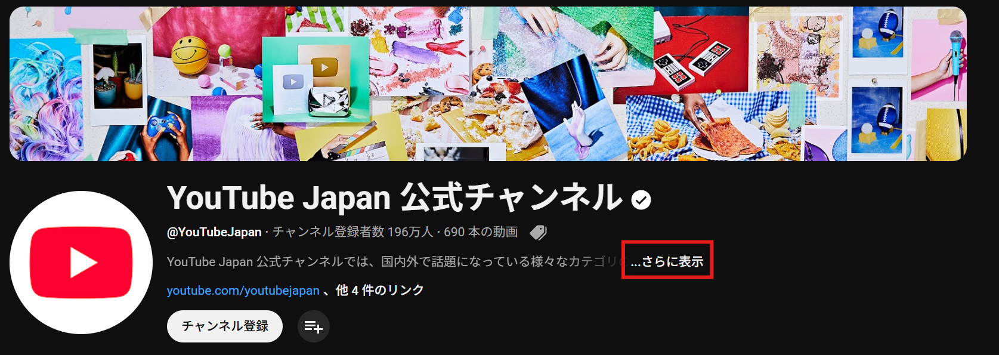
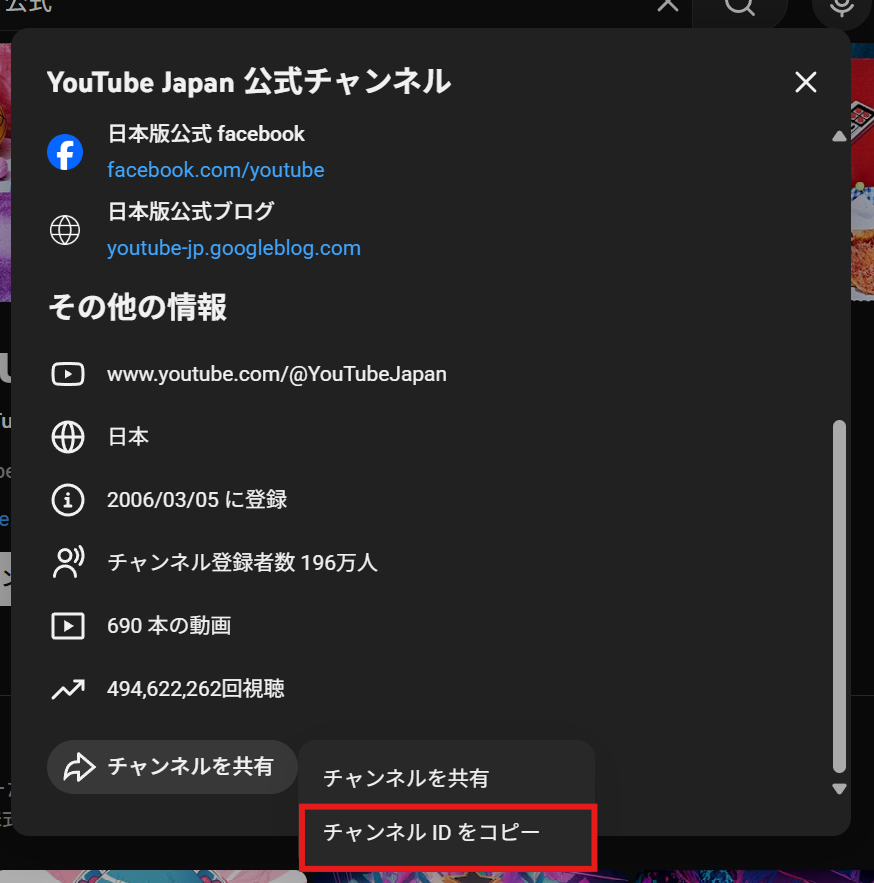
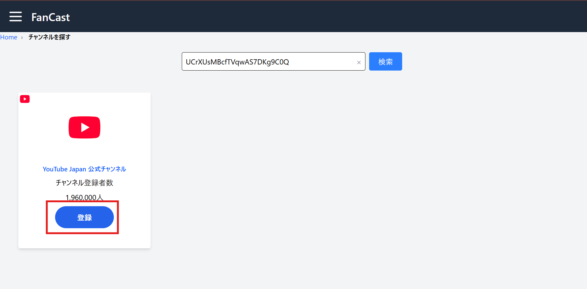
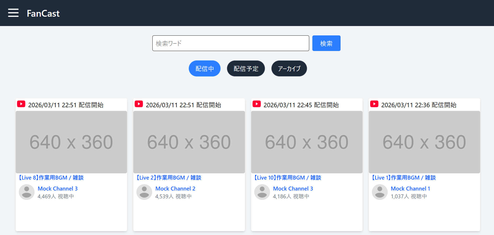
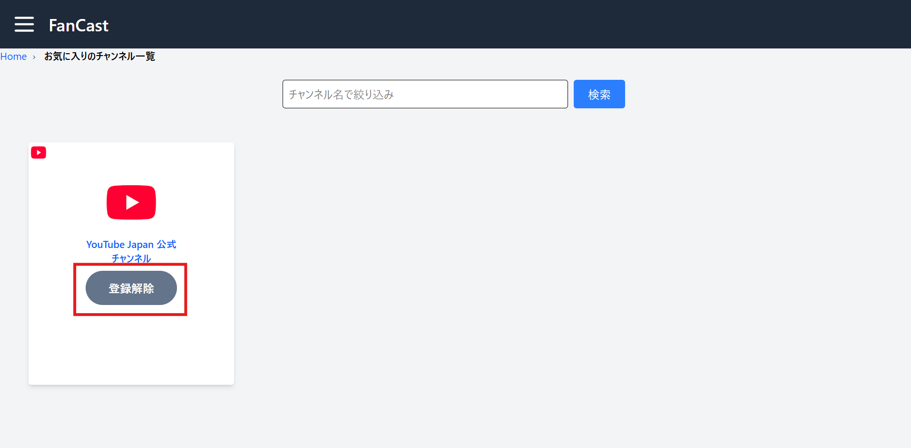

    ## サービス名
    FanCast

    ## URL
    https://fancast.jp/

    ## サービス概要
    FanCastは、好きなYouTube配信者のライブ配信・配信予定・アーカイブ動画を一覧で確認できるサービスです。

    ユーザーはアカウントを登録して自分の好きなYouTubeチャンネルを登録することができ、登録したチャンネルのコンテンツがカード型UIで一覧表示されます。
    これにより、複数のチャンネルを個別に確認することなく、配信状況を一つの画面でまとめて把握できます。

    また、未ログインはライブ配信中のものがランダムで20件を表示されます。
    こちらは作業用BGMがヒットするようにしています。

    ## このサービスへの思い・作りたい理由
    Vtuberやストリーマーの配信を日常的に視聴していると、「今日は誰が配信しているのか」「配信を見逃していないか」といった把握が難しくなることがあります。

    特にコラボ配信や突発配信、アーカイブが非公開になる配信などもあり、気づかないうちに見逃してしまうことも少なくありません。

    その中で、カバー株式会社が運営する「ホロライブプロダクション配信予定スケジュール」というサービスを利用するようになり、所属タレントの配信予定や動画を一覧で確認できることの便利さを実感しました。

    そこから、「自分の好きな配信者だけをまとめて表示できるサービスがあれば便利なのではないか」と考え、このサービスを作成しました。

    ## ユーザー層について
    本サービスは、複数の配信者を日常的に視聴しているユーザーを主な対象としています。

    ・複数のVtuberを視聴している人
    ・ゲーム実況者やストリーマーをよく視聴する人

    また、以下のようなユーザーにも利用を想定しています。
    ・YouTubeでライブ配信のニュースやイベントをよくチェックする人

    ## サービスの利用イメージ
    ユーザーは好きな配信者を検索し、チャンネルをリストに登録することができます。

    登録したチャンネルの配信中の枠、配信予定枠、アーカイブ動画などのコンテンツが一覧で表示されるため、各チャンネルのページを個別に確認する必要がなくなります。

    ## 主な機能
    ・アカウント登録機能
    ・ログイン機能
    ・ログイン後に利用できる機能
    　YouTubeチャンネルの追加 / 削除
    　配信中 / 配信予定 / アーカイブを切り替えるタブ表示
    ・カード型UIで以下の情報を表示
    　配信プラットフォームのアイコン
    　配信開始時刻
    　チャンネル名
    　サムネイル画像

    ## 使用技術

    | カテゴリ | 技術 |
    |---|---|
    | フロントエンド | Tailwind CSS / JavaScript |
    | バックエンド | Ruby 3.3.6 / Ruby on Rails 7.2.2 |
    | データベース | PostgreSQL |
    | API | YouTube Data API v3 |
    | インフラ | Docker / Render |

    ## アカウント

    ### 通常アカウント
    sample1@fancast.jp  
    password123

    ### デモ用アカウント（仕込みデータを表示）
    sample2@fancast.jp  
    password123

    ## 使い方

    ### ログイン

    1. ヘッダー左端のハンバーガーメニューアイコンをクリック  
    2. 「ログイン」リンクを押下  
    3. ログイン画面でアカウント情報を入力してログイン

    ### チャンネルの登録

    1. ヘッダー左端のハンバーガーメニューアイコンをクリック  
    2. 「チャンネルを探す」リンクを押下  
    3. 画面遷移後、検索バーに **UCから始まるチャンネルID** を入力して検索  

    #### チャンネルIDの確認方法

    1. YouTubeで登録したいチャンネルページにアクセス  
    https://www.youtube.com/@YouTubeJapan

    2. 「さらに表示」リンクを押下  

    

    3. 表示されたモーダルダイアログの最下部にある  
    「チャンネルを共有」→「チャンネルIDをコピー」を押下  

    

    4. コピーしたチャンネルIDをFanCastの検索バーに入力

    #### チャンネル登録

    検索結果が表示されるので、該当チャンネルを登録します。

    

    ### コンテンツの表示

    登録したチャンネルで以下のコンテンツがある場合、一覧で表示されます。

    ・配信中  
    ・配信予定  
    ・アーカイブ  

    ※画像はイメージ

    

    ### 登録したチャンネルの削除

    1. ヘッダー左端のハンバーガーメニューアイコンをクリック  
    2. 「お気に入りのチャンネル一覧」を押下  
    3. 登録しているチャンネル一覧が表示される  
    4. 削除したいチャンネルの **「登録解除」ボタン** を押下  

    